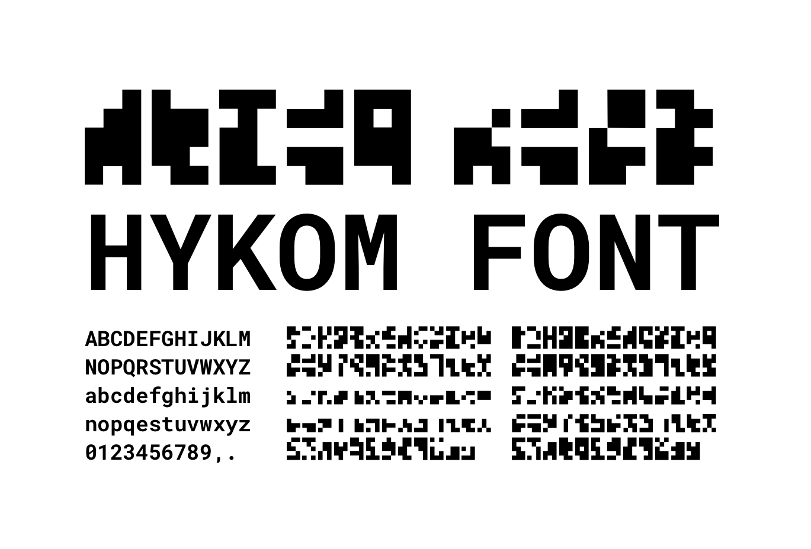

# HYKOM

## About

HYKOM is a concept font that I designed for the stage design of a staging of the play "Hysterikon" by Ingrid Lausund that happened on the 30th June 2022 at the Deutsches Schauspielhaus Hamburg.

The font is used in various designs such as posters, flyers and signs. The font is not a fixed font. Or it is. But you can make your own. With the same set of actions I followed to come up with this font. Basically HYKOM is not a font. But a set of actions (or algorithm) to come up with a unique font.

The font comes with upper- and lowercase letters, numbers 0-9 and characters for "." and ",". Letters come in two weights, where bold has a higher number of black pixels.

My main goal was to create a font that looked like some form of code or cryptic message and that had no rules, no way to decrypt it except for knowing which character is which. I tried to embody the hidden, meaningless, ever changing rules and systems of capitalism and consumerism that are also part of the stage design in this font.

The look is somewhere between QR code, morse code and the "Missingno" Pokemon.

## Algorithm

The font you can download and use from this repo is just one outcome of the algorithm I made up. If you want to create your own version you can follow these steps below.

### 1. Generate Noise Texture

We'll start of with a noise texture that is 114 pixels wide and 5 pixels high. We will use 3X5 pixels for each character and we'll have 26 letters, 10 numbers and two symbols, which results in a total of 38 characters. I used Simplex Noise with a pretty large scal in GIMP and generated this:

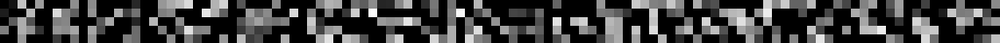

### 2. Create gradient overlay

Well use a gradient of the same size that runs from white to black and from top to bottom. Set it to "brighen only" layer mode and 50% opacity. I use this to generate lower case characters. This will look like this:

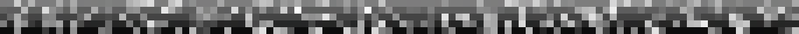

### 3. Use limiter tool to create 1-bit stripe

Next I use the limit tool (that makes all colors either white or black). Well use it at 50% for the bold font (which should give us 40% black pixels) and at 30% for the regular font. I do this on the texture with and without the gradient. This will result in 4 stripes:

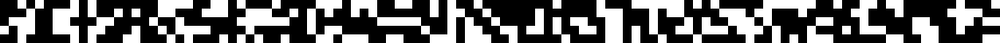

*No Gradient, 30% - used for uppercase regular*

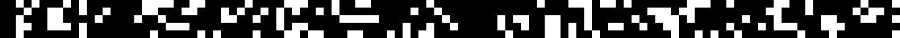

*No Gradient, 50% - used for uppercase bold*

*Gradient, 30% - used for lowercase regular*

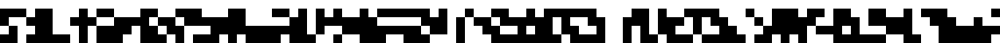

*Gradient, 40% - used for lowercase bold*

Sidenote: I decided to use a cut at 40% for the lowercase bold variant, as 50% resulted in the stripe looking to close to the uppercase one. Before continuing to use stripes you have to scale them up a bit (I did 10x so the stripes were 50px high).

### 4. Slice the stripes

I imported the stripes into Sketch, created slices with the correct dimensions (50px high and 30px wide for me) and spread them out equally to line up with the stripes using the distribute horizontally option tool. What you'll wanna do is cut out the single characters out of the stripe (with each character being 5px high and 3px wide). How you do it is up to you. I then exported each character as a PNG in standalone folders using 2x mode so each png will be 100px high.

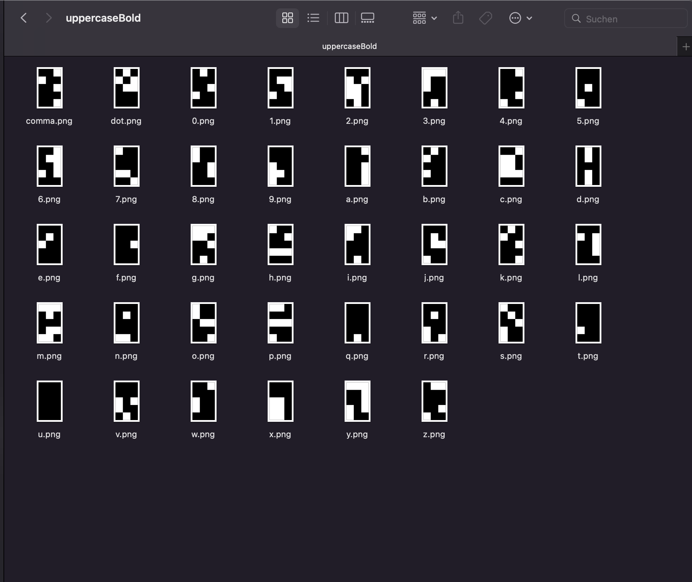

### 5. Turn PNG into SVG

I imported the stripes into sketch, created slices for all characters using the "Distribute Horizontally" tool. Then I imported all PNGs into Illustrator, distributed them and used the "Image Trace" tool to turn the PNGs into SVG paths. IMPORTANT: enable the ignore white optione, otherwise you will have the white pixels in the font as well. You can save some time by ignoring the numbers and symbols in the lowercase fonts. IMPORTANT: it doenst really matter that you import the images in the correct order, but if you want to keep the feeling of different weights and upper- and lowercase letters, make sure to import all layers in the same order and check each layer if the distribution didnt fuck up the layer order.

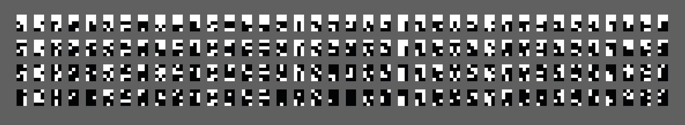

*All characters*

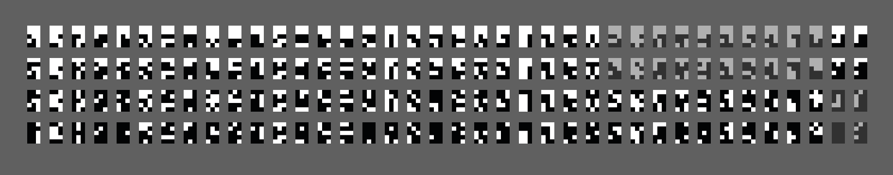

*Black character moved, uppercase comma and point disabled, lowercase numbers disabled*

Sidenote: I moved some characters around, so that the very black bold characters were used as numbers (where I only used the regular weights so it didnt really matter). The tracing has to be triggered manually for each image so this part is annoying af. Renaming the layers and images helps with easier import and export later. Illustrator will export each SVG croped to the outer edges, so you will have to insert an invisible rectangle the size of the full 5x3 character behind each character, otherwise they wont be the same size. I also had to scale down the whole group by around 20% to fit into Birdfonts grid.

### 6. Turn SVG into Font

Now to use all the SVGs we have as a font I used a font editor that has a batch import for SVG folders. BirdFont is free and has that feature, but others might as well. I created two different fonts for the two weights and then imported the folders, having to rename "point" into "." and "comma" into "," but otherwise that went down pretty smooth and I could export a TTF font from there.

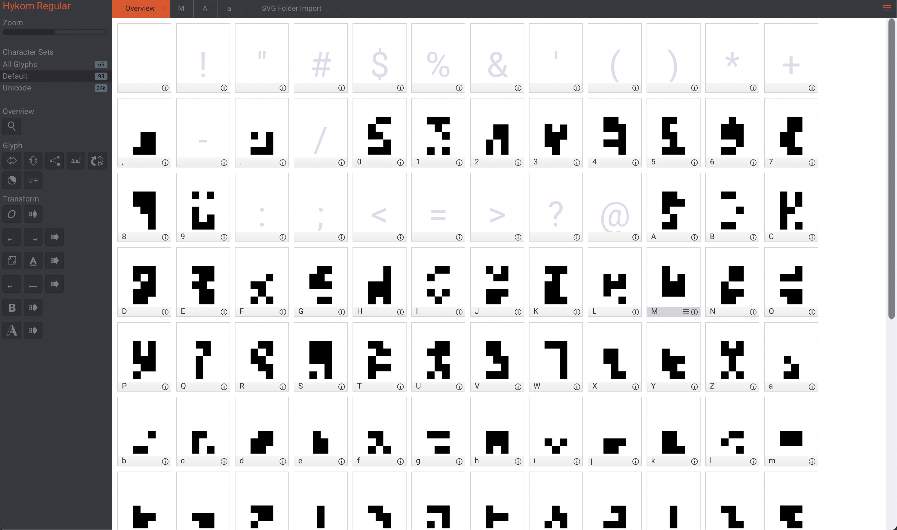

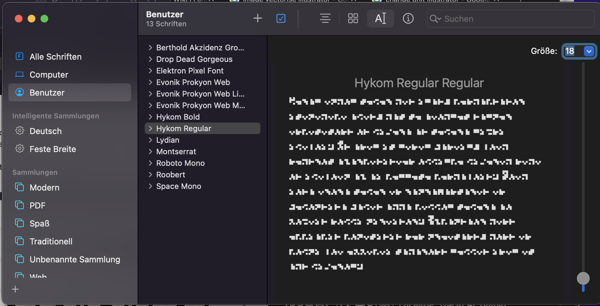

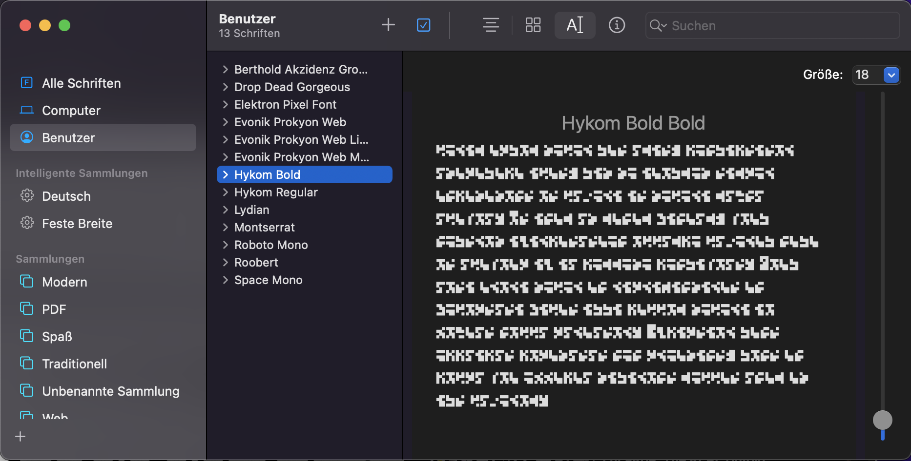